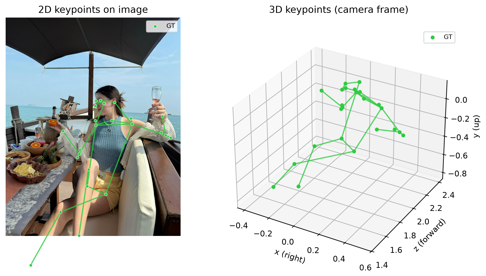

# POSE3D — Streamlit UI cho RTMPose3D

Dự án fine-tune mô hình 3D pose estimation trên schema POSE-24 (17 khớp
COCO body + 7 điểm giải phẫu), dựa trên kiến trúc RTMW3D của
[OpenMMLab mmpose](https://github.com/open-mmlab/mmpose) (project
`rtmpose3d`), port qua bản đóng gói pip-installable
[b-arac/rtmpose3d](https://github.com/b-arac/rtmpose3d) — backbone pretrained
`rtmpose-l_simcc-ucoco_dw-ucoco_270e-256x192` (CSPNeXt-L, OpenMMLab huấn
luyện trên COCO-WholeBody).

UI bằng **Streamlit** để chạy 3D pose estimation với mô hình đã fine-tune.
Cho phép **truyền model (checkpoint đã fine-tune) vào** rồi inference trên
ảnh, hiển thị 2D keypoints overlay + 3D skeleton.

App: `demo/app.py`

### Ví dụ output

## Môi trường

Máy đích: **NVIDIA GB10 (Grace Blackwell, aarch64)**, CUDA driver 580, toolkit hệ thống CUDA 13.0.
Điểm mấu chốt: kiến trúc **aarch64** + GPU Blackwell (sm_120), `mmcv` không có wheel sẵn
phù hợp nên phải **build từ source** với CUDA toolkit khớp major với PyTorch.

Môi trường đã verify hiện tại:

- `torch==2.12.1+cu130`
- CUDA toolkit build `mmcv`: `/usr/local/cuda-13.0`
- `mmcv==2.2.0`
- `mmpose==1.3.2`, `mmdet==3.3.0`, `mmengine==0.10.7`
- kiểm tra stack: `uv run python -c "import torch, cv2, mmcv, mmpose, mmengine; print('ok')"`

Quản lý môi trường bằng `uv` (`.venv` trong repo).

### 1. UI + PyTorch

    uv sync

`uv sync` chỉ cài phần UI (Streamlit, opencv, huggingface-hub, ...) — PyTorch
**cố ý không nằm trong `dependencies`** của `pyproject.toml` vì cần đúng
index CUDA theo từng máy (xem comment trong `pyproject.toml`). Cài riêng bản
CUDA phù hợp với máy, ví dụ CUDA 13.0 (đúng bản đã verify trong README này):

    uv pip install torch --index-url https://download.pytorch.org/whl/cu130

Nếu máy dùng CUDA khác, đổi `cu130` thành bản tương ứng (ví dụ `cu128`,
`cu121`, ...) — nhưng bước build `mmcv` bên dưới cũng phải đổi CUDA toolkit
khớp major với bản PyTorch đã chọn.

Kiểm tra GPU:

    uv run python -c "import torch; print(torch.__version__, torch.version.cuda, torch.cuda.is_available(), torch.cuda.get_device_name(0))"

### 2. Build mmcv từ source với CUDA 13.0

Với môi trường hiện tại `torch==2.12.1+cu130`, build `mmcv` bằng toolkit hệ thống
`/usr/local/cuda-13.0`:

    export CUDA_HOME=/usr/local/cuda-13.0
    export PATH=$CUDA_HOME/bin:$PATH
    export LD_LIBRARY_PATH=$CUDA_HOME/lib64:$CUDA_HOME/targets/sbsa-linux/lib:$LD_LIBRARY_PATH
    export CPATH=$CUDA_HOME/targets/sbsa-linux/include:$CPATH
    export LIBRARY_PATH=$CUDA_HOME/targets/sbsa-linux/lib:$LIBRARY_PATH
    export MMCV_WITH_OPS=1 FORCE_CUDA=1 MAX_JOBS=8
    export TORCH_CUDA_ARCH_LIST="8.0;9.0;10.0;12.0"

    uv pip install --force-reinstall opencv-python-headless
    uv pip install "setuptools<70" wheel
    uv pip install "mmcv==2.2.0" --no-binary mmcv --no-build-isolation

Build thực tế trên máy này mất khoảng 32 phút. Nếu build quá nặng, có thể giảm
`MAX_JOBS=4`.

### 3. mmpose / mmdet

xtcocotools (dep của mmpose) cần build, nên cài Cython trước rồi dùng `--no-build-isolation`:

    uv pip install cython numpy
    uv pip install xtcocotools --no-build-isolation
    uv pip install "mmengine>=0.7.0" "mmdet>=3.0.0" "mmpose>=1.0.0" tqdm --no-build-isolation

Kiểm tra toàn bộ stack (chỉ chạy `ok` được từ bước này trở đi):

    uv run python -c "import torch, cv2, mmcv, mmpose, mmengine; print('ok')"

### Ghi chú nếu dùng torch cu128 cũ

Một setup cũ từng dùng PyTorch `cu128` và CUDA toolkit riêng tại `$HOME/cuda128`.
Chỉ dùng đường đó nếu `torch.version.cuda` là `12.8`; không trộn `torch cu130` với
`CUDA_HOME=$HOME/cuda128` vì build `mmcv` sẽ lệch CUDA major.

## Chạy demo

**Chỉ muốn chạy demo, không tự train?** Không cần tải gì thủ công — nếu chưa
có checkpoint nào trong `work_dirs/` và `weights/` (đúng trường hợp vừa clone
repo), app tự động tải checkpoint đã fine-tune sẵn
(`best_MPJPE_epoch_269.pth`, ~400MB, tải một lần duy nhất) từ
[Hugging Face Hub](https://huggingface.co/phcatan9921/pose24-rtmpose3d-l) về
`weights/pose24_v4/` ngay khi bạn mở app. Model hiện đang **public**, tải
được ngay không cần đăng nhập/token.

Nếu bạn *đã có* `work_dirs/` với checkpoint riêng (ví dụ đang tự train/thử
nghiệm nhiều version), demo dùng đúng các session đó như trước, không có gì
thay đổi — cơ chế tải từ Hugging Face chỉ kích hoạt khi không tìm thấy
checkpoint nào ở cả 2 nơi.

Nếu sau này repo trên Hugging Face chuyển sang private (hoặc bạn bị giới hạn
tải ẩn danh), tạo file `.env` từ mẫu có sẵn rồi điền token:

    cp .env.example .env
    # sửa .env, điền HF_TOKEN=hf_xxxxxxxx (tạo tại
    # https://huggingface.co/settings/tokens, quyền Read là đủ)

`.env` đã có trong `.gitignore`, không bao giờ bị commit lên git.

Chạy demo:

    make demo

Hoặc thủ công:

    PYTHONPATH=src uv run streamlit run demo/app.py --server.port 8252 --server.address 0.0.0.0

Chạy demo kèm public URL qua Cloudflare Quick Tunnel (không cần mở port/firewall,
không cần tài khoản Cloudflare):

    make demo-tunnel

URL public dạng `https://xxx-xxx.trycloudflare.com` in ra trong log `cloudflared`
sau ~5-10 giây. `Ctrl+C` để tắt cả Streamlit và tunnel. Yêu cầu `cloudflared` đã
cài sẵn trên máy.

Trong sidebar:
- **Work dir (run)**: chọn thư mục `work_dirs/<run>` để lấy checkpoint + config
  tương ứng (mỗi lần train giữ bản copy config riêng, tự động khớp đúng).
- **Checkpoint**: chọn `best_MPJPE_epoch_*.pth` (mặc định) hoặc `epoch_*.pth` khác
  trong work_dir đã chọn.
- **Input source**: *Dataset sample* (duyệt ảnh + nhãn GT có sẵn trong
  `data/GT/`, chỉ khả dụng nếu bạn có thư mục này local) hoặc *Upload image*
  (tải ảnh bất kỳ lên để suy luận, không có nhãn GT để so sánh — dùng được
  ngay cả khi không có `data/GT/`). Nếu clone repo mới không có sẵn
  `data/GT/`, *Dataset sample* sẽ không hiển thị — chỉ dùng *Upload image*.
- **Compare with original RTMPose3D**: bật để xem thêm khung xương từ mô hình
  gốc (133-kp, cocktail14) cạnh khung xương đã fine-tune.

Bấm **Load model** -> chọn nguồn ảnh -> xem kết quả 2D overlay keypoints +
skeleton 3D tương tác (plotly).

## Dữ liệu

`data/GT/{images,labels}` — ảnh + nhãn ground-truth cho fine-tune. Thư mục
này bị `.gitignore` (nặng ~7GB) nên **không có sẵn khi clone repo** — nếu bạn
muốn tự train (không chỉ chạy demo với checkpoint có sẵn), cần tự chuẩn bị
dataset theo đúng cấu trúc dưới đây trước khi chạy `make train`.

### Chuẩn bị dataset để tự train

Cấu trúc `data/GT/`:

    data/GT/
    ├── images/           # Ảnh gốc, ví dụ 00BHo1J7MC.jpg
    ├── labels/           # Nhãn GT, 1 file JSON / ảnh, CÙNG TÊN với ảnh
    │   └── 00BHo1J7MC.json
    └── splits/           # Sinh tự động bởi `make splits`, đừng tự tạo tay
        ├── train.txt
        ├── val.txt
        └── test.txt

- Mỗi ảnh trong `images/` phải có đúng 1 file `.json` cùng tên trong
  `labels/` — nhãn gồm keypoint 3D theo hệ camera
  `x_right_y_down_z_forward` (đơn vị mét, root-relative theo khớp hông),
  bbox chuẩn hoá, và một vài field phụ trợ khác (xem
  `src/pose24/datasets/gt_json_dataset.py` để biết chính xác field nào được
  đọc khi train).
- Nhãn hiện tại của dự án được gán bằng pipeline SAM-3D-Body (không nằm
  trong repo này) — nếu bạn không có sẵn dataset đã gán nhãn theo định dạng
  này, cách nhanh nhất để thử train là dùng checkpoint đã fine-tune có sẵn
  (mục "Chạy app" ở trên) thay vì tự train từ đầu.
- Sau khi có `images/` + `labels/` đầy đủ, sinh 3 file split:

      make splits

  Lệnh này đọc toàn bộ `data/GT/labels/*.json`, chia ngẫu nhiên thành
  train/val/test rồi ghi danh sách tên file vào `data/GT/splits/*.txt`
  (script: `tools/make_splits.py`).

## Training

Có 4 config sẵn (`src/pose24/configs/rtmw3d_l_finetune_pose24_v1.py` →
`_v4.py`, khác nhau ở learning rate / regularization / `val_interval` — so
sánh chi tiết bằng cách đọc trực tiếp từng file config). Đổi `CONFIG`/`WORK_DIR`
để chọn version:

    make train CONFIG=src/pose24/configs/rtmw3d_l_finetune_pose24_v4.py WORK_DIR=work_dirs/pose24_v4

`WORK_DIR` **không cần tạo trước** — `tools/train.py` tự tạo thư mục này nếu
chưa tồn tại, rồi ghi vào đó: checkpoint (`epoch_*.pth`, `best_MPJPE_epoch_*.pth`),
log training, và một bản copy của `CONFIG` đã dùng (để sau này `make eval` /
`make visualize` / demo tự nhận diện đúng config khớp với checkpoint mà
không cần bạn chỉ định lại). Muốn train một version mới hoàn toàn (không
đụng tới các session cũ), chỉ cần đổi `WORK_DIR=work_dirs/<tên-mới>` — mỗi
`WORK_DIR` độc lập, các session khác trong `work_dirs/` không bị ảnh hưởng
và vẫn chọn được như cũ trong sidebar demo (mục "Work dir (run)").

Resume từ checkpoint gần nhất (đọc `last_checkpoint` trong work_dir):

    make train-resume CONFIG=src/pose24/configs/rtmw3d_l_finetune_pose24_v4.py WORK_DIR=work_dirs/pose24_v4

Đánh giá checkpoint (in MPJPE + P-MPJPE trên tập val):

    make eval CKPT_BEST=work_dirs/pose24_v4/best_MPJPE_epoch_30.pth

Xuất ảnh GT-vs-Pred (2D overlay + 3D skeleton):

    make visualize CKPT=work_dirs/pose24_v4/best_MPJPE_epoch_30.pth NUM=4

Vẽ biểu đồ MPJPE/P-MPJPE theo epoch (gộp mọi lần resume trong work_dir, lưu
`metrics_plot.png`):

    make plot-metrics WORK_DIR=work_dirs/pose24_v4

So per-joint MPJPE giữa checkpoint finetune và RTMPose3D-L gốc (pretrained,
133-kp cocktail14 — chỉ 17/24 khớp COCO body có tương ứng, 7 khớp giải phẫu
phụ báo N/A) trên cùng GT, kèm 3 ảnh phân tích (bar chart + 2 boxplot phân
phối lỗi) lưu vào `WORK_DIR/compare_baseline/`:

    make compare-baseline CKPT_BEST=work_dirs/pose24_v4/best_MPJPE_epoch_30.pth WORK_DIR=work_dirs/pose24_v4

## Cấu trúc thư mục

    POSE3D/
    ├── src/pose24/              # Package chính — bộ pose 24 keypoint
    │   ├── keypoints.py         # Định nghĩa 24 keypoint, tên, nối xương, cặp trái-phải
    │   ├── datasets/            # Đọc & tiền xử lý dữ liệu
    │   │   ├── gt_json_dataset.py  # Nạp nhãn GT (JSON) → 24 keypoint
    │   │   └── transforms.py       # Biến đổi/augment ảnh + keypoint khi train
    │   ├── codecs/              # Mã hoá/giải mã nhãn 3D (toạ độ ↔ dạng model học)
    │   ├── models/              # Định nghĩa mô hình
    │   │   ├── rtmw3d_head.py      # Đầu ra dự đoán keypoint 3D
    │   │   ├── pose_estimator.py   # Ghép thành mô hình ước lượng pose hoàn chỉnh
    │   │   ├── loss.py             # Hàm mất mát cơ bản
    │   │   └── structure_loss.py   # Mất mát giữ đúng cấu trúc/tỉ lệ khung xương
    │   ├── engine/hooks.py      # Tự xuất ảnh so sánh GT vs Pred trong lúc train
    │   ├── visualization/draw.py # Vẽ overlay 2D + skeleton 3D (GT vs Pred)
    │   └── configs/             # File cấu hình train/finetune
    │
    ├── tools/                   # Script chạy tay
    │   ├── make_splits.py       # Chia dữ liệu train/val/test
    │   ├── train.py             # Huấn luyện / finetune
    │   ├── eval.py              # Đánh giá checkpoint
    │   └── visualize.py         # Xuất ảnh kiểm tra keypoint
    │
    ├── demo/                    # App Streamlit demo inference
    │   └── app.py               # Giao diện chính (chọn work_dir/checkpoint, so baseline)
    │
    ├── tests/                   # Bộ test tự động (dataset, loss, model, pipeline, viz...)
    ├── data/GT/                 # Ảnh + nhãn ground-truth để finetune (gitignored)
    ├── work_dirs/               # Checkpoint & log từ các lần tự train (gitignored)
    ├── weights/                 # Checkpoint tải tự động từ Hugging Face Hub (gitignored)
    ├── vis/                     # Ảnh trực quan hoá xuất ra
    ├── .env.example             # Mẫu file .env (HF_TOKEN, xem mục "Chạy app")
    └── Makefile                 # Các lệnh tắt: test / lint / pre-commit / train...

## Phát triển

Các tác vụ dev gói trong `Makefile` (chạy `make help` để xem đầy đủ):

    make test         # chạy toàn bộ test suite (unit + loss + viz + pipeline + model + flip)
    make lint         # ruff check src/ tests/ tools/
    make pre-commit   # chạy tất cả pre-commit hooks trên mọi file

Cài hook tự chạy mỗi lần commit (tùy chọn):

    uv run pre-commit install

## Ghi chú

- 133 keypoints COCO-WholeBody (mô hình gốc, dùng để so baseline): body(17) +
  feet(6) + face(68) + hands(42). Mô hình đã fine-tune dùng schema riêng
  POSE-24 (17 body + 7 điểm giải phẫu), định nghĩa trong `src/pose24/keypoints.py`.
- Nhãn 3D theo quy ước camera `x_right_y_down_z_forward`, đơn vị mét
  (root-relative theo khớp hông).
- Checkpoint đã fine-tune (~400MB) tải tự động từ Hugging Face Hub vào
  `weights/` nếu không có sẵn `work_dirs/` local, xem mục "Chạy app" ở trên.
- PyTorch >= 2.6 mặc định `weights_only=True` làm hỏng load checkpoint cũ;
  `demo/app.py` đã gọi `torch.load(..., weights_only=False)` để tránh lỗi này.
- Nếu gặp `CUDA error: out of memory` lúc load model: kiểm tra `nvidia-smi`
  xem process khác (ví dụ một tiến trình `make train` khác) có đang chiếm
  VRAM không. Có thể chạy `Device = cpu` trong sidebar để test pipeline.
