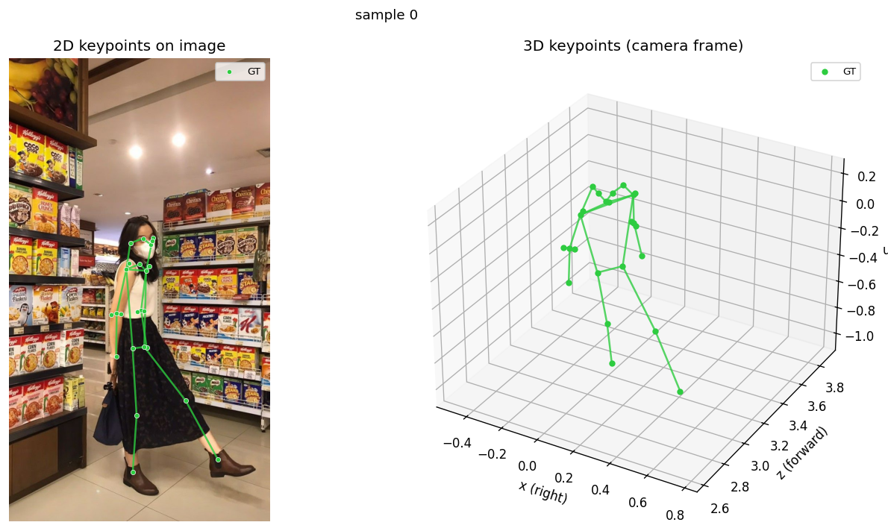

# POSE3D — Streamlit UI cho RTMPose3D

UI bằng **Streamlit** để chạy 3D pose estimation với [b-arac/rtmpose3d](https://github.com/b-arac/rtmpose3d).
Cho phép **truyền model (checkpoint đã fine-tune) vào** rồi inference trên ảnh, hiển thị 2D keypoints overlay + 3D skeleton.

App: `demo/app.py`

### Ví dụ output

## Môi trường

Máy đích: **NVIDIA GB10 (Grace Blackwell, aarch64)**, CUDA driver 580, toolkit hệ thống CUDA 13.0.
Điểm mấu chốt: kiến trúc **aarch64** + GPU Blackwell (sm_120), `mmcv` không có wheel sẵn
phù hợp nên phải **build từ source** với CUDA toolkit khớp major với PyTorch.

Môi trường đã verify hiện tại:

- `torch==2.12.1+cu130`
- CUDA toolkit build `mmcv`: `/usr/local/cuda-13.0`
- `mmcv==2.2.0`
- `mmpose==1.3.2`, `mmdet==3.3.0`, `mmengine==0.10.7`
- kiểm tra stack: `uv run python -c "import torch, cv2, mmcv, mmpose, mmengine; print('ok')"`

Quản lý môi trường bằng `uv` (`.venv` trong repo).

### 1. UI + PyTorch

    uv sync

Nếu môi trường chưa có PyTorch, cài bản CUDA phù hợp với máy. Với setup hiện tại đang dùng
PyTorch `cu130`; nếu đổi sang bản khác thì bước build `mmcv` bên dưới cũng phải đổi CUDA
toolkit tương ứng.

Kiểm tra GPU:

    uv run python -c "import torch; print(torch.__version__, torch.version.cuda, torch.cuda.is_available(), torch.cuda.get_device_name(0))"

### 2. Build mmcv từ source với CUDA 13.0

Với môi trường hiện tại `torch==2.12.1+cu130`, build `mmcv` bằng toolkit hệ thống
`/usr/local/cuda-13.0`:

    export CUDA_HOME=/usr/local/cuda-13.0
    export PATH=$CUDA_HOME/bin:$PATH
    export LD_LIBRARY_PATH=$CUDA_HOME/lib64:$CUDA_HOME/targets/sbsa-linux/lib:$LD_LIBRARY_PATH
    export CPATH=$CUDA_HOME/targets/sbsa-linux/include:$CPATH
    export LIBRARY_PATH=$CUDA_HOME/targets/sbsa-linux/lib:$LIBRARY_PATH
    export MMCV_WITH_OPS=1 FORCE_CUDA=1 MAX_JOBS=8
    export TORCH_CUDA_ARCH_LIST="8.0;9.0;10.0;12.0"

    uv pip install --force-reinstall opencv-python-headless
    uv pip install "setuptools<70" wheel
    uv pip install "mmcv==2.2.0" --no-binary mmcv --no-build-isolation

Build thực tế trên máy này mất khoảng 32 phút. Nếu build quá nặng, có thể giảm
`MAX_JOBS=4`.

Sau khi build:

    uv run python -c "import torch, cv2, mmcv, mmpose, mmengine; print('ok')"

### 3. mmpose / mmdet

xtcocotools (dep của mmpose) cần build, nên cài Cython trước rồi dùng `--no-build-isolation`:

    uv pip install cython numpy
    uv pip install xtcocotools --no-build-isolation
    uv pip install "mmengine>=0.7.0" "mmdet>=3.0.0" "mmpose>=1.0.0" tqdm --no-build-isolation

### Ghi chú nếu dùng torch cu128 cũ

Một setup cũ từng dùng PyTorch `cu128` và CUDA toolkit riêng tại `$HOME/cuda128`.
Chỉ dùng đường đó nếu `torch.version.cuda` là `12.8`; không trộn `torch cu130` với
`CUDA_HOME=$HOME/cuda128` vì build `mmcv` sẽ lệch CUDA major.

## Chạy app

Chạy demo:

    make demo

Hoặc thủ công:

    PYTHONPATH=src uv run streamlit run demo/app.py --server.port 8252 --server.address 0.0.0.0

Chạy demo kèm public URL qua Cloudflare Quick Tunnel (không cần mở port/firewall,
không cần tài khoản Cloudflare):

    make demo-tunnel

URL public dạng `https://xxx-xxx.trycloudflare.com` in ra trong log `cloudflared`
sau ~5-10 giây. `Ctrl+C` để tắt cả Streamlit và tunnel. Yêu cầu `cloudflared` đã
cài sẵn trên máy.

Trong sidebar:
- **📥 Tải model về**: clone checkpoint ngay trong app — từ *URL trực tiếp*,
  *HuggingFace Hub* (repo id + tên file), hoặc *checkpoint mặc định RTMPose3D*.
  File tải về cache `~/.cache/rtmpose3d/checkpoints/`, dùng được luôn qua mục
  *Đã tải về* bên dưới.
- **Model size**: `l` (large) hoặc `x` (extra large).
- **Pose checkpoint**: chọn *Mặc định* (auto-download), *Đã tải về* (từ mục tải
  ở trên), *Đường dẫn/URL* (trỏ checkpoint **fine-tune** của bạn), hoặc *Upload .pth*.
- **Pose config**: để trống dùng mặc định theo model size, hoặc trỏ config riêng.
- **Detector**: tùy chọn, mặc định auto-download RTMDet-M.
- **Device**: `cuda:0` hoặc `cpu`.

Bấm **Load model** -> upload ảnh -> **Chạy inference**. Kết quả: ảnh 2D overlay keypoints +
skeleton 3D tương tác (plotly).

## Dữ liệu

`data/GT/{images,labels}` — ảnh + nhãn ground-truth cho fine-tune.

## Training

Có 4 config sẵn (`src/pose24/configs/rtmw3d_l_finetune_pose24_v1.py` →
`_v4.py`, khác nhau ở learning rate / regularization / `val_interval` — chi
tiết trong `ARCHITECTURE.md`). Đổi `CONFIG`/`WORK_DIR` để chọn version:

    make train CONFIG=src/pose24/configs/rtmw3d_l_finetune_pose24_v3.py WORK_DIR=work_dirs/pose24_v3

Resume từ checkpoint gần nhất (đọc `last_checkpoint` trong work_dir):

    make train-resume CONFIG=src/pose24/configs/rtmw3d_l_finetune_pose24_v3.py WORK_DIR=work_dirs/pose24_v3

Đánh giá checkpoint (in MPJPE + P-MPJPE trên tập val):

    make eval CKPT_BEST=work_dirs/pose24_v3/best_MPJPE_epoch_30.pth

Xuất ảnh GT-vs-Pred (2D overlay + 3D skeleton):

    make visualize CKPT=work_dirs/pose24_v3/best_MPJPE_epoch_30.pth NUM=4

Vẽ biểu đồ MPJPE/P-MPJPE theo epoch (gộp mọi lần resume trong work_dir, lưu
`metrics_plot.png`):

    make plot-metrics WORK_DIR=work_dirs/pose24_v3

So per-joint MPJPE giữa checkpoint finetune và RTMPose3D-L gốc (pretrained,
133-kp cocktail14 — chỉ 17/24 khớp COCO body có tương ứng, 7 khớp giải phẫu
phụ báo N/A) trên cùng GT, kèm 3 ảnh phân tích (bar chart + 2 boxplot phân
phối lỗi) lưu vào `WORK_DIR/compare_baseline/`:

    make compare-baseline CKPT_BEST=work_dirs/pose24_v3/best_MPJPE_epoch_30.pth WORK_DIR=work_dirs/pose24_v3

## Cấu trúc thư mục

    POSE3D/
    ├── src/pose24/              # Package chính — bộ pose 24 keypoint
    │   ├── keypoints.py         # Định nghĩa 24 keypoint, tên, nối xương, cặp trái-phải
    │   ├── datasets/            # Đọc & tiền xử lý dữ liệu
    │   │   ├── gt_json_dataset.py  # Nạp nhãn GT (JSON) → 24 keypoint
    │   │   └── transforms.py       # Biến đổi/augment ảnh + keypoint khi train
    │   ├── codecs/              # Mã hoá/giải mã nhãn 3D (toạ độ ↔ dạng model học)
    │   ├── models/              # Định nghĩa mô hình
    │   │   ├── rtmw3d_head.py      # Đầu ra dự đoán keypoint 3D
    │   │   ├── pose_estimator.py   # Ghép thành mô hình ước lượng pose hoàn chỉnh
    │   │   ├── loss.py             # Hàm mất mát cơ bản
    │   │   └── structure_loss.py   # Mất mát giữ đúng cấu trúc/tỉ lệ khung xương
    │   ├── engine/hooks.py      # Tự xuất ảnh so sánh GT vs Pred trong lúc train
    │   ├── visualization/draw.py # Vẽ overlay 2D + skeleton 3D (GT vs Pred)
    │   └── configs/             # File cấu hình train/finetune
    │
    ├── tools/                   # Script chạy tay
    │   ├── make_splits.py       # Chia dữ liệu train/val/test
    │   ├── train.py             # Huấn luyện / finetune
    │   ├── eval.py              # Đánh giá checkpoint
    │   └── visualize.py         # Xuất ảnh kiểm tra keypoint
    │
    ├── demo/                    # App Streamlit demo inference
    │   ├── app.py               # Giao diện chính (đã finetune)
    │   └── rtm/                 # App tham chiếu RTMPose3D gốc
    │
    ├── tests/                   # Bộ test tự động (dataset, loss, model, pipeline, viz...)
    ├── data/GT/                 # Ảnh + nhãn ground-truth để finetune
    ├── work_dirs/               # Nơi lưu checkpoint & log khi train
    ├── vis/                     # Ảnh trực quan hoá xuất ra
    ├── Makefile                 # Các lệnh tắt: test / lint / pre-commit / train...
    ├── ARCHITECTURE.md          # Mô tả kiến trúc hệ thống
    └── GT_JSON_GUIDE.md         # Hướng dẫn định dạng nhãn GT JSON

## Phát triển

Các tác vụ dev gói trong `Makefile` (chạy `make help` để xem đầy đủ):

    make test         # chạy toàn bộ test suite (unit + loss + viz + pipeline + model + flip)
    make lint         # ruff check src/ tests/ tools/
    make pre-commit   # chạy tất cả pre-commit hooks trên mọi file

Cài hook tự chạy mỗi lần commit (tùy chọn):

    uv run pre-commit install

## Ghi chú

- 133 keypoints COCO-WholeBody: body(17) + feet(6) + face(68) + hands(42).
- 3D theo quy ước Z-up, đơn vị mét (camera-relative).
- Lần đầu với checkpoint mặc định tải ~330MB về `~/.cache/rtmpose3d/checkpoints/`.
- PyTorch >= 2.6 mặc định `weights_only=True` làm hỏng load checkpoint cũ;
  `rtmpose3d/inference.py` đã vá `torch.load` về `weights_only=False`.
- Nếu gặp `CUDA error: out of memory` lúc load model: GB10 dùng unified memory,
  kiểm tra `nvidia-smi` xem process khác có đang chiếm VRAM không. Có thể chạy
  `Device = cpu` để test pipeline.
- Pipeline đã verify chạy đúng (1 người, 133 keypoints 2D+3D) trên ảnh mẫu.
